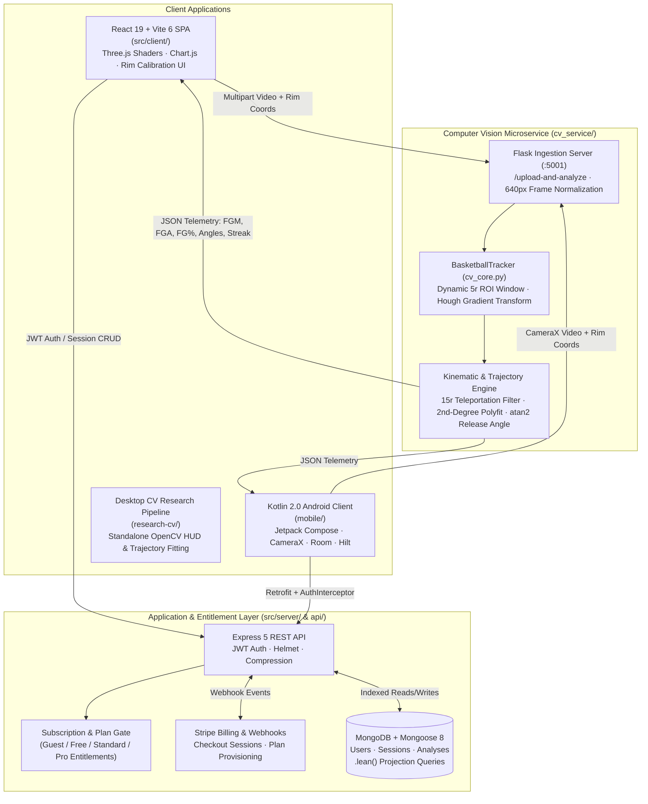

# Nothing But Net — AI Basketball Shot Analytics & Computer Vision Monorepo

<div align="center">

**Full-Stack Computer Vision & Predictive Trajectory Modeling Platform for Basketball Shooting Telemetry**

[](https://nothingbutnet.online)
[](https://maciekgeneja.me/blog/nothing-but-net)

[](https://react.dev/)
[](https://vite.dev/)
[](https://expressjs.com/)
[](https://opencv.org/)
[](./mobile)
[](https://www.mongodb.com/)
[](https://stripe.com/)

</div>

---

## Executive Overview

**Nothing But Net** ([nothingbutnet.online](https://nothingbutnet.online)) is a multi-platform sports analytics and computer vision system that transforms raw courtside video into biomechanical and statistical shooting telemetry. From a single user-calibrated hoop reference frame, the computer vision engine detects the basketball across frames, rejects false-positive visual artifacts using kinematic displacement bounds, fits a 2nd-degree polynomial trajectory ($y = Ax^2 + Bx + C$) via least-squares regression, computes release angle kinematics, and classifies shot outcomes (FGM, FGA, FG%, make/miss angle differentials, and streak metrics).

This repository consolidates the complete production ecosystem into a unified monorepo while preserving root deployment paths for zero-downtime continuous delivery across **Vercel** (Frontend SPA & Serverless API) and **Render** (Express API & Python CV Microservice):

- **Web Platform (`src/client/`)**: React 19 & Vite 6 single-page application built around the custom **Liquid Glass & Ember** design system, featuring Three.js (`LiquidEther`) WebGL shaders, Framer Motion micro-interactions, interactive hoop coordinate calibration, and Chart.js historical telemetry.
- **Core REST API (`src/server/`, `api/`)**: Node.js & Express 5 backend governing JWT session authentication, email verification workflows, tiered subscription entitlements (`guest`, `free`, `standard`, `pro`), Stripe Checkout & webhook lifecycle management, and lean MongoDB aggregation queries.
- **Computer Vision Microservice (`cv_service/`)**: Production Python, Flask, and OpenCV inference engine implementing dynamic Region-of-Interest (ROI) Hough gradient tracking, adaptive frame-skipping, physics-based outlier rejection, and automated regression benchmarking against human-labeled ground truth.
- **Native Android Companion (`mobile/`)**: Kotlin 2.0 & Jetpack Compose mobile client utilizing CameraX for courtside video capture, Dagger Hilt dependency injection, Retrofit multipart ingestion, EncryptedSharedPreferences JWT security, and Room offline persistence.
- **Desktop Research & Calibration Suite (`research-cv/`)**: Standalone OpenCV + NumPy desktop laboratory for real-time trajectory overlay rendering, Hough parameter tuning, and polynomial regression experimentation.

---

## System Architecture & Monorepo Map



### Repository Directory Structure

```text
nothing-but-net/
├── src/
│   ├── client/                  # React 19 + Vite 6 SPA ("Liquid Glass & Ember" Design System)
│   │   ├── components/          # Rim Coordinates selector, VideoUpload, LiquidEther shader, LiquidGlassGraph
│   │   ├── context/             # AnalysisContext state orchestration
│   │   ├── hooks/               # useEntitlements subscription tier gating
│   │   └── pages/               # Landing, Home, Results, Profile, Auth & Verification views
│   └── server/                  # Express 5 REST API
│       ├── middleware/          # JWT auth guard, express-validator schemas, centralized errorHandler
│       ├── models/              # Mongoose schemas (User, Session, Analysis)
│       ├── tests/               # Backend unit tests (dbUtils.test.js)
│       ├── server.js            # API routes, Stripe webhook processor & entitlement enforcement
│       └── .env.example         # Safe environment variable template
├── api/
│   └── index.js                 # Vercel serverless entrypoint bridging Express app
├── cv_service/                  # Production Python + OpenCV Computer Vision Microservice
│   ├── src/
│   │   ├── cv_core.py           # BasketballTracker: ROI Hough detection, physics filtering & polyfit
│   │   └── server.py            # Flask API (:5001), adaptive frame skipping & 640px normalization
│   ├── tests/                   # Automated accuracy test bench & ground_truth.json verification
│   └── tools/                   # server_benchmark.py & visual_debug.py profiling utilities
├── mobile/                      # Native Kotlin 2.0 + Jetpack Compose Android Companion App
│   ├── app/src/main/            # CameraX capture, Hilt DI, Room DAO/Provider, Retrofit CV client
│   └── app/src/test/            # Coroutine ViewModel & DTO unit tests
├── research-cv/                 # Standalone OpenCV Desktop Trajectory Research & Calibration Suite
│   ├── main.py                  # Interactive Tkinter/OpenCV desktop tracker & HUD visualizer
│   └── Resources/               # Calibration images & benchmark basketball footage
├── benchmarks/                  # Node.js V8 & Mongoose serialization performance benchmarks
│   ├── baseline.js              # Unoptimized multi-pass array reductions & full hydration baseline
│   └── optimized.js             # Single-pass O(N) aggregation & .lean() projection benchmarks
├── tests/                       # End-to-end server login & integration verification scripts
├── render.yaml                  # Render Blueprint (nothing-but-net-api + nothing-but-net-cv)
└── vercel.json                  # Vercel SPA & API routing configuration
```

---

## Algorithmic & Performance Engineering

### 1. Geometric Rim Calibration & Scale Invariance (`cv_service/src/cv_core.py`)

Rather than relying on fixed pixel radii that fail under varying camera distances and resolutions, the CV pipeline normalizes all incoming video streams to a canonical width of `640px` (`scale = 640.0 / frame.shape[1]`) and derives the expected basketball radius directly from the Euclidean distance between the user-calibrated left $(x_L, y_L)$ and right $(x_R, y_R)$ rim coordinates:

$$d_{\text{hoop}} = \sqrt{(x_R - x_L)^2 + (y_R - y_L)^2}, \qquad r_{\text{est}} = 0.264 \cdot d_{\text{hoop}}$$

where $0.264$ reflects the regulation physical ratio between a standard basketball radius ($4.75\text{ in}$) and an $18\text{ in}$ inner rim diameter. Hough Circle search bounds are constrained to $[r_{\min}, r_{\max}] = \left[\lfloor r_{\text{est}} / 1.2 \rfloor, \lfloor 1.2 \cdot r_{\text{est}} \rfloor\right]$, eliminating small background noise and large player head/torso contours.

### 2. Two-Tier Dynamic ROI Hough Tracking & Adaptive Frame Skipping

Running full-frame Hough Gradient transforms across 1080p/60fps video is computationally expensive. `BasketballTracker.find_ball()` implements a hierarchical two-tier search strategy:

1. **Tier 1 — Hot-Path Region-of-Interest (ROI) Search**: When a valid ball center $(x_{t-1}, y_{t-1})$ exists from the prior frame, the tracker crops a localized bounding window of margin $m = 5 \cdot r_{\max}$ around $(x_{t-1}, y_{t-1})$, applies a $7 \times 7$ Gaussian kernel, and executes `cv2.HoughCircles` exclusively inside the sub-matrix before transforming candidate coordinates back to global frame space:
   $$(x_{\text{global}}, y_{\text{global}}) = (x_{\text{roi}} + x_1,\; y_{\text{roi}} + y_1)$$
   Candidate circles are scored by minimum squared Euclidean distance to $(x_{t-1}, y_{t-1})$.
2. **Tier 2 — Full-Frame Fallback & Adaptive Frame Skipping (`server.py`)**: If the ball enters the frame for the first time or exits the local ROI window, the detector falls back to full-frame search. During inactive stretches (`tracker.center is None`), `analyze_video()` dynamically widens the frame-skip interval up to `30` frames and snaps back to fine-grained sampling (`base_skip = int(1 / accuracy)`) the instant a ball is acquired.

### 3. Physics-Based Outlier Rejection & Parabolic Trajectory Regression

To prevent rim reflections, net movement, or background spheres from corrupting the trajectory state:

- **Kinematic Teleportation Guard**: Any candidate detection whose squared displacement from the previous verified center exceeds $(15 \cdot r_{\max})^2$ in a single step is rejected as a physical impossibility:
  $$(x_t - x_{t-1})^2 + (y_t - y_{t-1})^2 > (15 \cdot r_{\max})^2 \implies \text{Reject Detection}$$
- **Occlusion & Glitch Reset**: If `ball_lost_count` exceeds `20` consecutive frames during an active shot, the partial trajectory buffer is purged to prevent stale coordinate stitching across separate possessions.
- **2nd-Degree Polynomial Least-Squares Fitting**: While the ball is in the active shooting zone ($y \le y_{\text{hoop\_min}} + 5r$), frame-by-frame $(x_i, y_i)$ coordinates are fit to a parabolic arc via Vandermonde least-squares (`np.polyfit(pos_list_x, pos_list_y, 2)`):
  $$\hat{y}(x) = A x^2 + B x + C$$
- **Release Angle Kinematics**: Initial launch vectors are computed over the primary ascent frames using four-quadrant inverse tangent transformation:
  $$\theta_{\text{release}} = -\text{deg}\left(\text{atan2}(y_2 - y_0,\; x_2 - x_0)\right), \quad \text{normalized to } (0^\circ, 90^\circ)$$
- **Make / Miss Classification & Cooldown**: A shot attempt is registered when the trajectory apexes above the rim plane ($y < y_{\text{hoop\_min}}$) and subsequently crosses downward through the rim's vertical threshold ($y_t > y_{\text{hoop\_min}}$). The horizontal crossing coordinate $\bar{x} = \frac{1}{2}(x_t + x_{t-1})$ is tested against $(x_L, x_R)$ with a 30-frame post-shot cooldown to prevent double-counting net rebounds.

### 4. Backend & Telemetry Performance Benchmarks (`benchmarks/`)

To keep dashboard rendering and API responses sub-millisecond as user session histories scale, `benchmarks/baseline.js` and `benchmarks/optimized.js` profile five hot paths across $N = 10,000$ session records:

| Benchmark Area ($N = 10,000$ Sessions) | Baseline Architecture | Optimized Architecture | Measured Improvement |
| :--- | :--- | :--- | :--- |
| **1. Profile Stats Aggregation** | 3 separate `.reduce()` passes over session arrays | Single-pass `for` loop accumulating `makes`, `misses`, and `longest_streak` | **~3.1× faster** ($O(3N) \to O(N)$ with zero closure allocation) |
| **2. Chart.js Dataset Preparation** | 4 separate `.map()` passes allocating intermediate arrays | Pre-allocated fixed-length arrays (`new Array(N)`) populated in 1 loop | **~2.6× faster** |
| **3. API JSON Serialization** | Overfetching full documents including `shot_angles[100]` & `shots_results[100]` | Projecting lean summary fields (`makes`, `misses`, `longest_streak`, `fg_percentage`, `sessionDate`) | **~85% smaller payload** & **~6× faster `JSON.stringify`** |
| **4. Database Hydration** | Full Mongoose document instantiation (`new Model()`) | `.lean()` plain-object queries bypassing Mongoose getters/setters | Eliminates hydration overhead on read-only analytics routes |
| **5. CV Hot-Path Processing** | Full-frame 1080p Hough transform (`~45–60ms/frame`) | `640px` scaling + $5r$ Dynamic ROI cropping (`cv_core.py`) | **~6–9ms/frame** (`100+ FPS` core throughput) |

Run the Node.js benchmark suite directly:

```bash
node benchmarks/baseline.js
node benchmarks/optimized.js
```

---

## Quick Start & Local Orchestration

### Prerequisites

- **Node.js** 18+ and **npm**
- **Python** 3.10+ and **pip**
- **MongoDB** (local instance on `:27017` or MongoDB Atlas URI)
- **JDK 11+** & **Android SDK 35** *(optional, for building `mobile/`)*

### 1. Install Web, API & CV Dependencies

```bash
# Install Node.js frontend and backend dependencies
npm install

# Install Python Computer Vision microservice dependencies
pip install -r cv_service/requirements.txt
```

### 2. Configure Environment Variables

Copy the example environment templates and populate your local credentials:

```bash
cp .env.example .env
cp .env.client.example .env.local
cp src/server/.env.example src/server/.env
```

Required keys in `src/server/.env`:

```env
PORT=3000
JWT_SECRET=your_jwt_secret_here
MONGODB_URI=mongodb://localhost:27017/nbnc
EMAIL_USER=your_email@gmail.com
EMAIL_PASS=your_app_password_here
STRIPE_SECRET_KEY=sk_test_your_stripe_secret_key
STRIPE_PUBLISHABLE_KEY=pk_test_your_stripe_publishable_key
STRIPE_WEBHOOK_SECRET=whsec_your_stripe_webhook_secret
```

### 3. Launch the Full Stack Locally

Run the React 19 Vite dev server (`:5173`), Express 5 REST API (`:3000`), and Python Flask CV service (`:5001`) concurrently with a single command:

```bash
npm run dev-all
```

Or launch individual services:

```bash
npm run dev            # Vite React 19 Frontend (http://localhost:5173)
npm run server         # Express 5 Backend API (http://localhost:3000)
npm run python-server  # Flask OpenCV Microservice (http://localhost:5001)
```

### 4. Computer Vision Test Bench & Profiling Suite

```bash
# Run automated CV accuracy verification against ground_truth.json
python cv_service/tests/test_bench.py

# Run core cv_core.py FPS benchmark + end-to-end HTTP upload latency benchmark
python cv_service/tools/server_benchmark.py

# Run visual HUD debugger on sample footage
python cv_service/tools/visual_debug.py
```

### 5. Native Kotlin Android Companion (`mobile/`)

```bash
cd mobile

# Execute unit test suite (ViewModels, coroutines & DTO serialization)
./gradlew testDebugUnitTest

# Build debug APK
./gradlew assembleDebug
```

### 6. Standalone Desktop Research Pipeline (`research-cv/`)

```bash
cd research-cv
pip install -r requirements.txt
python main.py
```

---

## Deployment Architecture

Production infrastructure is declaratively defined at the repository root:

- **Frontend & Serverless Routing (`vercel.json`)**: Deploys the Vite bundle (`dist/`) to [nothingbutnet.online](https://nothingbutnet.online) with `/api/*` serverless rewrite rules.
- **Backend & CV Microservices (`render.yaml`)**: Orchestrates two managed Render web services:
  - `nothing-but-net-api` (Node.js runtime executing `node src/server/server.js`)
  - `nothing-but-net-cv` (Python 3.11 runtime executing `gunicorn --chdir cv_service/src server:app --timeout 120`)

---

## Author

**Maciek Geneja**
- Portfolio & Architectural Write-Up: [maciekgeneja.me/blog/nothing-but-net](https://maciekgeneja.me/blog/nothing-but-net)
- Live Application: [nothingbutnet.online](https://nothingbutnet.online)
- GitHub: [@Maseeek](https://github.com/Maseeek)
